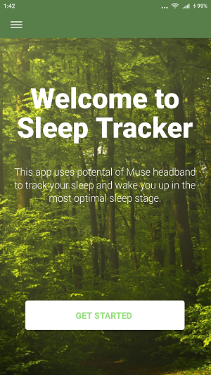
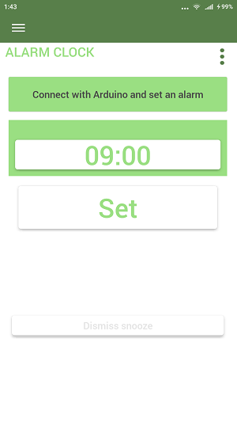
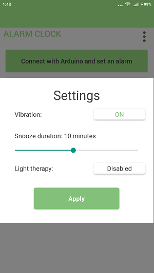
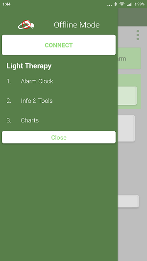
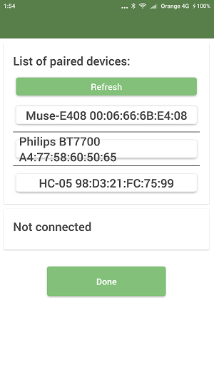

# Muse Sleep Tracker + Arduino Light Therapy (EN/PL/DE) RN 0.57.8 

After more than half of the year of inactivity I finally found some time and motivation to make some tweaks and upload app I've been working on. Sadly it's not finished yet and to be honest I don't know when I will start to continue development.

It contains some interesting modules such as library that allows to read CSV files and display as interactive graphs (not fully finished), reworked alarms module and many others. You can use it for free as long as it's not commercial.

So far I managed to trigger an alarm with alpha waves (closing eyes for more than 10s should do the job) BUT the frequency might vary for each of us so it's not foolproof. Install apk file and check it yourself ;) If it doesn't work, try to change `trackerScore` to your value in `night-tracker.js` or/and `power-nap.js` (which are basically very similar).

I cleaned uploaded project as much as I could. Here is the version with all `node_modules` in case you have some problems to install them [CLICK](https://drive.google.com/file/d/1kYRd-EMWxpUvadm74EFVTqwUpeBrm4lB/view?usp=sharing).

## Overview

This app uses potental of Muse headband and it's mother app [EEG101](https://github.com/NeuroTechX/eeg-101) to track your sleep and wake you up in the most optimal sleep stage. 
It also contains Light Therapy module based on Arduino.

Sleep Tracker is divided into Online and Offline Mode. 

Online Mode - requires Muse headband and contains five sections:
* Sleep Tracker - tracks your night sleep and aims to wake you up in the lightest sleep stage shortly before desired wake up time.
* Power Nap - tracks your nap, detects lightests sleep stage and wakes you up.

	Both of them provide optional Light Therapy depending on users choices.
* EEG sandbox - realtime EEG graph that originally comes from EEG 101.
* Info & Tools - EEG recorder, some basic info and Light Therapy LED test button.
* Charts 

Offline Mode - doesn't require Muse headband and contains three sections:
* Alarm Clock - functional alarm clock that can be connected with Light Therapy.
* Info & Tools - some basic info and Light Therapy LED test button.  
* Charts 

Light Therapy module is not necessary to use the app. Can be used as an addon to the tracker or Alarm clock. If it's on - the green light bulb icon appears near the menu button.
Charts section is common for both modes and depicts graphs based on five last users EEG records.

## How it works (assumed principles of operation)

* Sleep Tracker: 

	- checks theta/delta waves ratio every second (for the whole night if it's first usage; 1,5h before desired wake up time if it's not first usage) and saves it every 30 seconds to .csv file that's used to generate graph in Charts section.
	
	- basing on EEG records estimates and detects second sleep stage (lightest one which occurs before deep sleep).
	
	- wakes you up before the deep sleep stage as short as possible before desired wake up time.
	
* Power Nap:

	- uses Sleep Tracker's EEG records to estimate and detect second sleep stage.
	
	- wakes you up before the deep sleep stage.

* Light Therapy:

	- gradually lights up LEDs facing users eyelids shortly before alarm time (10 minutes if you use it with Sleep Tracker or Alarm Clock; 5 minutes if you use it with Power Nap).
	
Sleep Tracker and Power Nap use only frontal electrodes, because it's significantly easier to mainain them in the right position while sleeping.

## To do

* This is let's say aplha version, so it's more than likely that many things require improvements.
* Remove bug that terminates app after pressing `OK, IT'S ON` while bluetooth is already enabled (works when bt is disabled)
* Finish and correct translations (German especially)/typos etc.
* Update to newest RN version.
* Clean some mess in CSVGraph.java packages and finish this section.
* Buttons under `List of paired devices:` have to be adjustable to the length of paired device's names (see screenshot)

## Setup

1. Install and setup [React Native](https://facebook.github.io/react-native/docs/getting-started.html). Note: Sleep Tracker uses lots of native code, so create-react-native-app and Expo are not an option. Follow the instructions for "Building Apps with Native Code." You may also need to install the [JDK](https://www3.ntu.edu.sg/home/ehchua/programming/howto/JDK_Howto.html), [Node](https://nodejs.org/en/download/package-manager/), [Watchman](https://medium.com/@vonchristian/how-to-setup-watchman-on-ubuntu-16-04-53196cc0227c), and the [Gradle Daemon](https://docs.gradle.org/2.9/userguide/gradle_daemon.html) as well.
2. Install [yarn](https://github.com/yarnpkg/yarn).
3. Clone this repo `git clone https://github.com/vasyl91/muse-sleep-tracker-and-arduino-light-therapy.git` or download zip and extract it.
4. Open terminal in the `muse-sleep-tracker-and-arduino-light-therapy-master` folder and run `yarn install`. 
5. Connect an Android device with USB debug mode enabled. Because the LibMuse library depends on an ARM architecture, emulators are not an option.
6. Run `react-native start` to start React packager.
7. In new terminal, run `adb reverse tcp:8081 tcp:8081` to ensure debug server is connected to your device and then `react-native run-android` to install Sleep Tracker.

## Displaying example graphs

Paste `nights` from `charts` to `SleepTracker` folder on your phone.

## Arduino Light Therapy blueprints

To build it you will need:
	* Arduino Nano V3 ATMega328P
	* HC-05 Bluetooth Module
	* 3,7V battery
	* 2x LED
	* 2x 330 ohm resistor
	* ON/OFF switch
	* and obviously some wires

You can find the scheme in the light_therapy folder.

## Arduino setup

1. Download and install the [Arduino Desktop IDE](https://www.arduino.cc/en/Guide/HomePage).
2. Connect Arduino Nano via USB.
3. Open installed program.
4. Tools>Board: "Arduino Nano".
5. Tools>Processor: "ATmega328P (Old Bootloader)".
6. File>Open... choose `arduino_bluetooth_led_brightness_control.ino` from light_therapy folder.
7. Sketch>Upload.

## Common setup problems

1. Gradle build error: Attribute "title" has already been defined

- Solution: Make sure build tools is using latest version in in app/build.gradle (ie. 25.0.1) [http://stackoverflow.com/questions/39184283/attribute-title-has-already-been-define-when-have-android-plot-dependencies-1]

2. INSTALL_FAILED_UPDATE_INCOMPATIBLE: Package com.sleep_tracker signatures do not match the previously installed version; ignoring!

- Solution: Uninstall any pre-existing versions of the app on your device

3. Could not connect to development server

- Solution: Make sure that the device is connected, run `adb reverse tcp:8081 tcp:8081`, and restart the React packager (`react-native-start`)

4. Could not get BatchedBridge

- Solution: Run `adb reverse tcp:8081 tcp:8081` again and reload

5. Error retrieving parent for item: No resource found that matches the given name 'android:TextAppearance.Material.Widget.Button.Borderless.Colored'

 - Solution: Make sure [compileSdkVersion and appcompat match](http://stackoverflow.com/questions/32075498/error-retrieving-parent-for-item-no-resource-found-that-matches-the-given-name) in in app build.gradle
 
6. node_modules\react-native-bluetooth-serial\android\src\main\java\com\rusel\RCTBluetoothSerial\RCTBluetoothSerialPackage.java:23: error: method does not override or implement a method from a supertype

 - Solution: Delete `@Override` from line no. 23 in `RCTBluetoothSerialPackage.java`

7. If you want to release your own APK, go to node_modules\react-native-bluetooth-serial\android\build.gradle and change following lines like this:

	```xml
		android {
			compileSdkVersion 27
			buildToolsVersion "27.0.2"
			
			/*
			defaultConfig {
				minSdkVersion 16
				targetSdkVersion 22
				versionCode 1
				versionName "1.0"
				ndk {
					abiFilters "armeabi-v7a", "x86"
				}
			}
			*/
		}
	```
	
## Gallery


 
 

 

